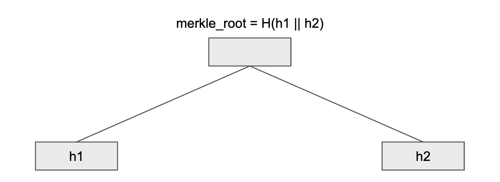
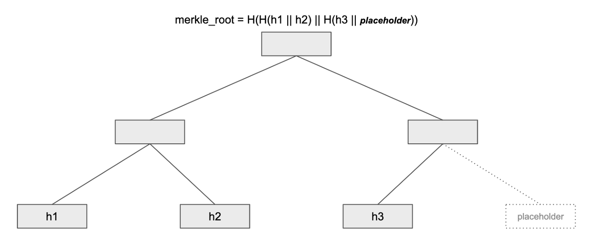
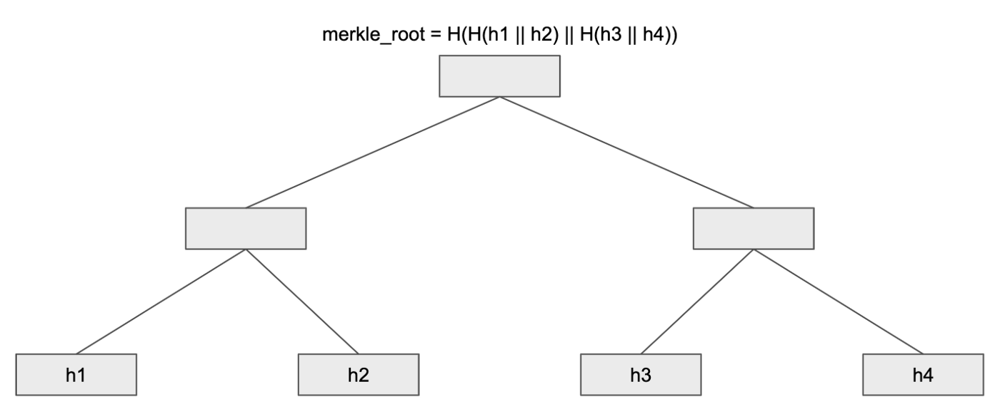
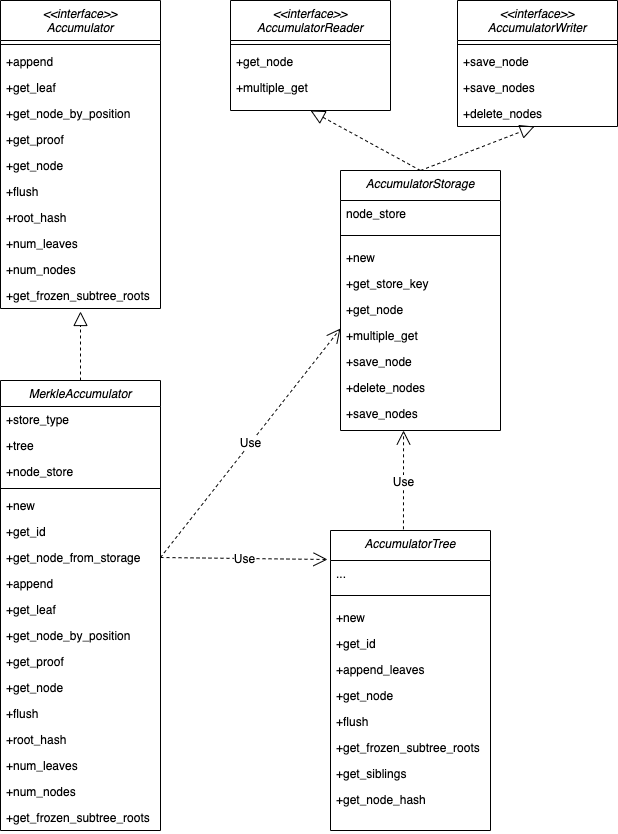

The Merkle Accumulator is an append-only Merkle tree that the Starcoin Blockchain uses to store the transaction_info hash. Merkle accumulators can provide proofs that a transaction was included in the chain (“proof of inclusion”). They are also called "history trees" in literature.

<!--more-->

## Overview
The accumulator module is designed to serve two primary purposes:
Persist the blockchain data, specifically the transactions and block that have been agreed by validators via consensus protocol.
Provide a response with Merkle proofs to any query that asks for a part of the blockchain data. A client can easily verify the integrity of the response if they have obtained the correct root hash.

The accumulator can be usesd the following service in the Starcoin Blockchain:

## TransactionInfo
The storage of TransactionInfo is a Merkle Tree Accumulator structure. Whenever a new transaction is added to the blockchain, the transaction will be put to the rightmost leaf in the merkle tree. Therefore, the value of the merkle root will change every time when a new transaction is committed and the merkle tree will grow with time. Given an ever growing tree, the transaction merkle tree is also named transaction accumulator.

Assume there is a merkle tree with 2 levels, the merkle root is calculated as the hash of the concatenation of h1 and h2.

There is a new transaction h3 executed successfully and added to the transaction accumulator. Since every non-leaf node is the hash of its two children, a default leaf node is needed. This default leaf node is a placeholder in order to maintain the rule of the merkle root calculation and will be replaced by the next transaction.

As the figure shows above, the value of the merkle root has changed after a new transaction was added. Also, in this case, the size of the tree has grown bigger.
It’s worth noting that because of the irreversible nature of blockchain the left side of the transaction accumulator is deemed to be finalized (h1, h2, and the parent). The value of these 3 nodes won’t be changed again in the event of new leaves being added so they could be saved to the disk.
When a node has all its descendants being non-placeholder — it becomes “Frozen”.

For writing to disk, Diem nodes write all the children of a node before the parent by their post-order position. In this way, the physical representation of the tree is append-only. Once written to physical storage, nodes won’t be either modified or deleted. Here, nodes with post-order position 1 to 3 are now frozen in the disk and the next node that will be written to the disk must be with position 4.
Now, another new transaction h4 arrives.

The placeholder was replaced by h4 and the merkle root has changed again. Also, the whole tree is now considered as frozen and the rest of the tree can be written to the disk in the order of post-order position
Ledger history is represented by a Merkle accumulator. Each time a transaction T is added to the blockchain, a TransactionInfo structure containing the transaction T, the root hash for the state Merkle tree after the execution of T and the root hash for the event Merkle tree generated by T is appended to the accumulator.

## Block
In the starcoin blockchain, in order to quickly determine whether the synchronized block is in the current chain (of course not limited to this function), we also adopted the structure of the accumulator. You only need to provide the hash value of the judged block, and then you only need to verify whether the certificate obtained based on this hash value passes or not.
Processing retention is similar to transaction_info, so I won’t go into details here.

## Class diagram of accumulator
Below diagram shows the structure of the accumulator, especially the classes that exist in the accumulator, the internal structure of the classes, their relationships with other classes, etc.
