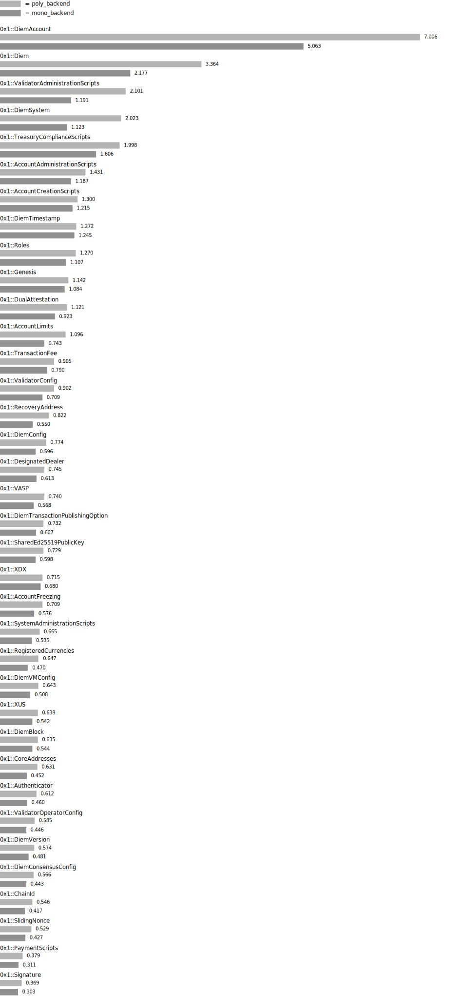

# Benchmarking polymorphic vs monomorphic encoding

This lab compares two different backend version. In the traditional polymorphic one, a universal domain `$Value` is
used which is the union of all possible values. Structs are represented as `Vec $Value`. For generic values, `$Value` is
used, otherwise the unboxed representation wherever this is possible (non-generic parameters and locals). Equality
over `$Value` is available and uses stratification to bound the recursion depth.

The monomorphic backend encoding differs as follows:
- Structs are represented as ADTs. Structs and vectors are specialized for all type instaniations found in the program.
This also means that equality is specialized and does not require stratification any longer. Specification functions are
specialized as well.
- Memory is specialized. We now access memory via a single address index as the type index is compiled away.
- Mutations are strongly typed as `$Mutation T`. This assumes strong edges for write-back.
- We verify a generic function (and the memory it uses) by declaring the type parameters as global given types. The
conjecture here is that if verification succeeds for this, it will also succeed for every instantiation (parametric
polymorphism). This probably likely needs a more formal proof down the road.
- For inlined functions, we generate specialized versions for instantiations on the call site. For calls to opaque
functions, we specialize the pre and post conditions at the caller side and insert them there.

## Module Verification Time

## Function Verification Time

